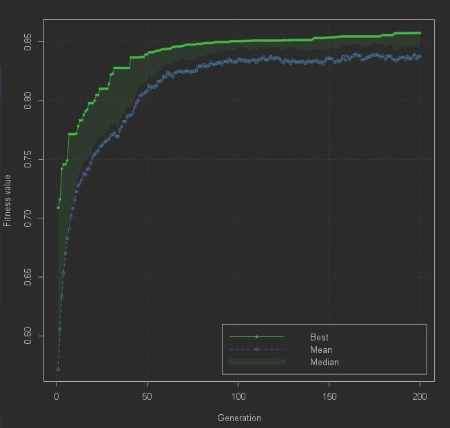

# Keyboard Layout Evaluation and Genetic Algorithm Search

Source code for evaluating a keyboard layout or to try to find the best possible layout using a genetic algorithm.

I implemented this solution to: implement a layout evaluation that 
 takes into account swiping motions; and as an exercise to better learn the R programming language. 

I tried to make it flexible to account for different layout preferences.
New fitness functions can be added and weighted with respect to personal preference.

I do not claim this solution is better than any other solution!

## Fitness.R

The file defines the final fitness to be used by Evaluate.R and GA.R.

Individual fitness measures can be weighted according to preference.

The weights used by each particular measure can be modified in the files present in the folders: fitness; and data.

## Evaluate.R

Used to evaluate the fitness of all the keyboard layouts defined in the "layouts" folder.

The layouts and their fitness are displayed from least to most fit (the last printed is the fittest).

## GA.R

Used to run a genetic algorithm to try to find the best possible layout(s) for the given fitness function.

Requires the Genetic Algorithm library. Sources:
[Anaconda](https://anaconda.org/conda-forge/r-ga);
[Github](https://luca-scr.github.io/GA/articles/GA.html)

The following image is a preview:

