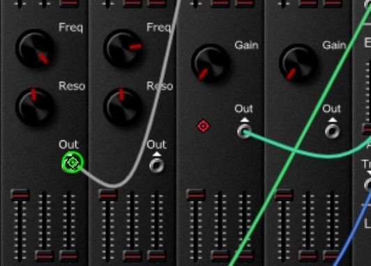

#  &nbsp; Colored Joy Mouse

Use one or multiple controllers as a mouse. 

Run the script once per controller, each of the controllers will be assigned to a differently colored cursor.

When the left or right equivalent buttons are pressed on the controller the original computer cursor will teleport to the colored cursor and the respective mouse button press will be sent.

The picture below illustrates the use of this script with 2 controllers on the g200kg modular web synthesizer to allow 2 users to interact with the interface without needing to share a controller. Note however that it is not possible for both users to interact with the interface at the same time.

